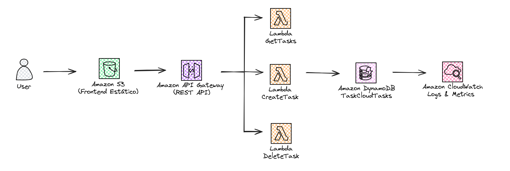

# TaskCloud - Aplicación Serverless de Gestión de Tareas

**Proyecto Final - Cloud Computing**  
Universidad de Antioquia 2025  
Profesor: Juan Pablo Arango

---

## Descripción

TaskCloud es una aplicación web serverless de gestión de tareas implementada completamente en AWS. Demuestra el uso de servicios cloud modernos siguiendo las mejores prácticas de la industria.

### Características

- Frontend estático hospedado en Amazon S3
- Backend serverless con AWS Lambda (Node.js 18)
- Base de datos NoSQL con Amazon DynamoDB
- API RESTful con Amazon API Gateway
- Infraestructura de red con VPC personalizada
- Monitoreo con Amazon CloudWatch
- Arquitectura 100% serverless y escalable

---
### Arquitectura del Sistema


---

## Tecnologías Utilizadas

**AWS Services:**
- Amazon S3 - Hosting de frontend estático
- AWS Lambda - Funciones serverless (Node.js 18, 256 MB)
- Amazon DynamoDB - Base de datos NoSQL (On-demand)
- Amazon API Gateway - API REST con CORS
- Amazon VPC - Red virtual privada
- Amazon EC2 - Instancia de demostración (t2.micro)
- AWS IAM - Gestión de permisos
- Amazon CloudWatch - Logs y monitoreo

**Frontend:** HTML5, CSS3, JavaScript (Vanilla)

**Backend:** Node.js 18.x, AWS SDK v3, UUID v4

---

## Estructura del Proyecto
```
taskcloud-project2/
├── README.md
├── frontend/
│   ├── index.html
│   ├── error.html
│   └── assets/
│       ├── css/styles.css
│       └── js/main.js
├── backend/lambda/
│   ├── package.json
│   └── src/
│       ├── handlers/
│       │   ├── getTasks.js
│       │   ├── createTask.js
│       │   └── deleteTask.js
│       ├── utils/
│       └── config/
├── infrastructure/
│   ├── stop-ec2.sh
│   ├── start-ec2.sh
│   └── infrastructure-info.txt
└── docs/
    ├── DOCUMENTACION_TECNICA.md
    └── cost-estimate.png
```

---

## Endpoints de la API

| Método | Endpoint | Descripción |
|--------|----------|-------------|
| GET | /tasks | Obtener todas las tareas |
| POST | /tasks | Crear nueva tarea |
| DELETE | /tasks/{taskId} | Eliminar tarea |

**Ejemplos:**
```bash
# Obtener tareas
curl https://hoswnx8mtc.execute-api.us-east-1.amazonaws.com/prod/tasks

# Crear tarea
curl -X POST https://hoswnx8mtc.execute-api.us-east-1.amazonaws.com/prod/tasks \
  -H "Content-Type: application/json" \
  -d '{"taskText": "Nueva tarea"}'
```

---

## Costos

### Estimación Mensual

| Servicio | Costo/Mes |
|----------|-----------|
| Amazon EC2 (10% utilización) | $0.85 |
| Amazon S3 | $0.10 |
| Amazon DynamoDB | $0.25 |
| AWS Lambda | $0.00 (Free Tier) |
| API Gateway | $0.00 (Free Tier) |
| CloudWatch | $3.50 |
| **TOTAL** | **$4.70/mes** |

Con Free Tier activo: ~$1-2/mes durante el primer año

---

## Despliegue Rápido

### Prerequisitos
- Cuenta de AWS
- AWS CLI configurado
- Node.js 18+

### Pasos

1. **Crear DynamoDB:**
```bash
aws dynamodb create-table \
    --table-name TaskCloudTasks \
    --attribute-definitions AttributeName=taskId,AttributeType=S \
    --key-schema AttributeName=taskId,KeyType=HASH \
    --billing-mode PAY_PER_REQUEST
```

2. **Crear bucket S3:**
```bash
aws s3 mb s3://taskcloud-frontend-tunombre
aws s3 website s3://taskcloud-frontend-tunombre \
    --index-document index.html
```

3. **Desplegar Lambda:**
```bash
cd backend/lambda
npm install
zip -r getTasks.zip src/ node_modules/ package.json
# Crear funciones en AWS Console o CLI
```

4. **Subir frontend:**
```bash
cd frontend
aws s3 sync . s3://taskcloud-frontend-tunombre
```

---

## Seguridad

**Implementado:**
- IAM Roles con principio de menor privilegio
- Validación y sanitización de datos
- HTTPS obligatorio en API Gateway
- Security Groups restrictivos

**Para producción:**
- Autenticación con AWS Cognito
- AWS WAF para protección de API
- CloudTrail para auditoría
- Rate limiting avanzado

---

## Monitoreo

Dashboard en CloudWatch con métricas de:
- Lambda: invocations, errors, duration
- DynamoDB: read/write capacity
- API Gateway: requests, latency
```bash
# Ver logs
aws logs tail /aws/lambda/TaskCloud-GetTasks --follow
```

---

## Aprendizajes

- Arquitectura serverless y sus beneficios
- Integración de múltiples servicios AWS
- Optimización de costos con pay-per-use
- Seguridad cloud con IAM
- Infrastructure as Code
- Monitoreo y observabilidad

---

## Información del Proyecto

**Autor:** Jonathan David Ardila Gomez  
**Email:** david.ardila1@udea.edu.co  
**Universidad:** Universidad de Antioquia  
**Curso:** Cloud Computing 2025  
**Fecha:** Diciembre 2025

---

## URLs del Proyecto

- **Frontend:** http://taskcloud-frontend-deividdev.s3-website-us-east-1.amazonaws.com
- **API:** https://hoswnx8mtc.execute-api.us-east-1.amazonaws.com/prod

---

## Licencia

MIT License - Proyecto Académico
